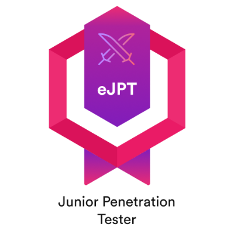
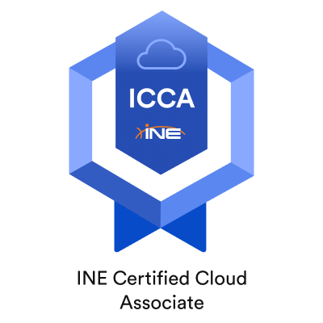
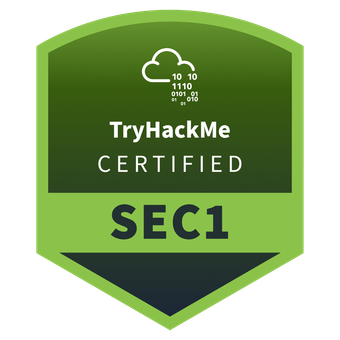

## 🚀 About
<ul dir="auto">
<li> Security Operations Analyst specializing in threat detection, incident response, and cloud security, with a strong foundation in system administration and IT support. I work daily with modern security tooling and log sources to identify, triage, and contain threats across diverse environments, while continuously improving processes and playbooks within the SOC.</li>
<li> I hold the eJPT and ICCA certifications, which validate my skills in penetration testing, network security, and cloud-centric defensive strategies. I actively sharpen my expertise through hands-on labs and CTF-style platforms, focusing on topics such as SIEM monitoring, vulnerability assessment, and security hardening in AWS, Azure, and GCP. My long-term goal is to transition into a dedicated Pentester/Red Team role, leveraging my SecOps background to design realistic attack simulations and help organizations proactively identify and remediate their weakest points.</li>
</ul>

## 🔧 Skills
### ⌨️ Programming

### 💻 Operating Systems

### ☁️ Cloud

### 🧰 Hacking Tools

### 🗃️ Others

## 🎓 Certifications:

      

## 🔎 Find Me:

