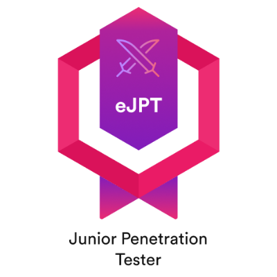
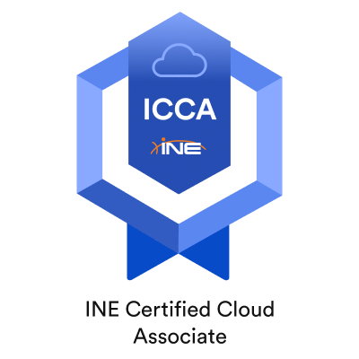
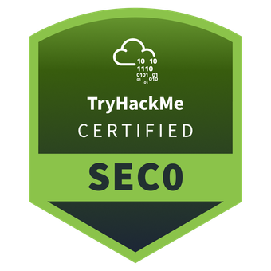
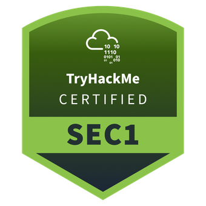

<!-- ══════════════════════════ HERO BANNER ══════════════════════════ -->

  <picture>
    <source media="(prefers-color-scheme: dark)"  srcset="./assets/dark.svg">
    <source media="(prefers-color-scheme: light)" srcset="./assets/light.svg">
    
  </picture>

  
  
  
  

 

## Who I am

Security Operations Analyst specializing in **threat detection, incident response, and cloud security**, with a strong foundation in system administration and IT support. I work daily with modern security tooling and log sources to identify, triage, and contain threats across diverse environments, while continuously improving processes and playbooks within the SOC.

I hold the **eJPT** and **ICCA** certifications, which validate my skills in penetration testing, network security, and cloud-centric defensive strategies. I sharpen my expertise through hands-on labs and CTF-style platforms, focusing on SIEM monitoring, vulnerability assessment, and security hardening across AWS, Azure, and GCP.

My long-term goal is to move into a dedicated **Pentester / Red Team** role, leveraging my SecOps background to design realistic attack simulations and help organizations proactively find and fix their weakest points.

 

## What I'm working on

| | |
|---|---|
| **Location** | Spain |
| **Role** | Security Operations Analyst |
| **Studying** | `THM SAL1` *(in progress)* · `THM PT1` *(in progress)* |
| **Next up** | Offensive security — attack path design and adversary simulation |

 

## Toolbox

**Cloud & infrastructure**

  
  
  
  
  
  

**Security operations**

  
  
  
  
  
  

**Offensive security**

  
  
  
  
  
  
  

 

## Certifications

| Certification | Issuer | Status |
|---|---|:--:|
| eJPT — Junior Penetration Tester | INE Security | ✅ |
| ICCA — Certified Cloud Associate | INE Security | ✅ |
| ISO/IEC 27001:2022 Lead Auditor | MasterMind | ✅ |
| SOC Level 0 | TryHackMe | ✅ |
| Security Engineer 101 | TryHackMe | ✅ |
| SAL1 — Security Analyst Level 1 | TryHackMe | 🔄 |
| PT1 — Penetration Tester Level 1 | TryHackMe | 🔄 |

 

## Stats

  <picture>
    <source media="(prefers-color-scheme: dark)"  srcset="https://github-readme-stats.vercel.app/api?username=Kujikato&show_icons=true&hide_border=true&border_radius=14&bg_color=0F172A&title_color=22D3EE&icon_color=7C3AED&text_color=94A3B8&ring_color=10B981">
    
  </picture>
  <picture>
    <source media="(prefers-color-scheme: dark)"  srcset="https://github-readme-stats.vercel.app/api/top-langs/?username=Kujikato&layout=compact&hide_border=true&border_radius=14&langs_count=6&bg_color=0F172A&title_color=22D3EE&text_color=94A3B8">
    
  </picture>

 

## Reach me

  <a href="https://linkedin.com/in/ernestogabrielandresnieto"><b>LinkedIn</b></a> ·
  <a href="https://tryhackme.com/p/Kujikato"><b>TryHackMe</b></a> ·
  <a href="https://app.hackthebox.com/profile/1643736"><b>Hack The Box</b></a> ·
  <a href="https://github.com/Kujikato"><b>GitHub</b></a>

  Open to conversations about detection engineering, cloud security, and red team work.

## 🔧 Skills
### ⌨️ Programming

### 💻 Operating Systems

### ☁️ Cloud

### 🧰 Hacking Tools

### 🗃️ Others

## 🎓 Certifications:

      

## 🔎 Find Me:

