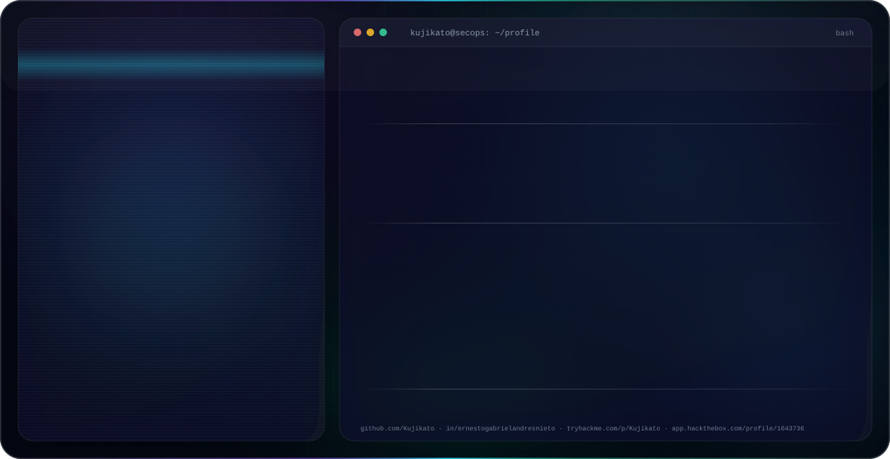

<!-- ══════════════════════════ HERO BANNER ══════════════════════════ -->

  <picture>
    <source media="(prefers-color-scheme: dark)"  srcset="./dark.svg">
    
  </picture>

  
  
  
  

## What I'm working on

| | |
|---|---|
| **Location** | Spain |
| **Role** | Security Operations Analyst |
| **Studying** | `THM SAL1` *(in progress 🔄)* · `THM PT1` *(in progress 🔄)* |
| **Next up** | Offensive security — attack path design and adversary simulation |

## 🎓 Certifications:

<table align="center">
  <tr>
    <td align="center" width="20%">
       
      <a href="https://certs.ine.com/5d270063-6337-423e-9809-24dacc788644"><b>eJPT</b> Junior Penetration Tester</a>
    </td>
    <td align="center" width="20%">
       
      <a href="https://certs.ine.com/1a10c024-e999-46ae-988c-b7aa1b39c76b"><b>ICCA</b> INE Certified Cloud Associate</a>
    </td>
    <td align="center" width="20%">
       
      <a href="https://assets.tryhackme.com/certification-certificate/69adc2a8bd6b6145d62afaaa.pdf"><b>THM SEC0</b> Security Fundamentals</a>
    </td>
    <td align="center" width="20%">
       
      <a href="https://assets.tryhackme.com/certification-certificate/69d134d017db38bb493550e2.pdf"><b>THM SEC101</b> Security Essentials</a>
    </td>
    <td align="center" width="20%">
       
      <a href="https://www.credly.com/badges/ada89a95-ad3a-4092-93a1-27aa39f10ca1/public_url"><b>Google Cloud</b> Cybersecurity Certificate</a>
    </td>
  </tr>
</table>

## 🔧 Skills
### 🤖 AI

### ☁️ Cloud

### 💻 Operating Systems

### 🧰 Hacking Tools

### ⌨️ Programming

### 🗃️ Others

